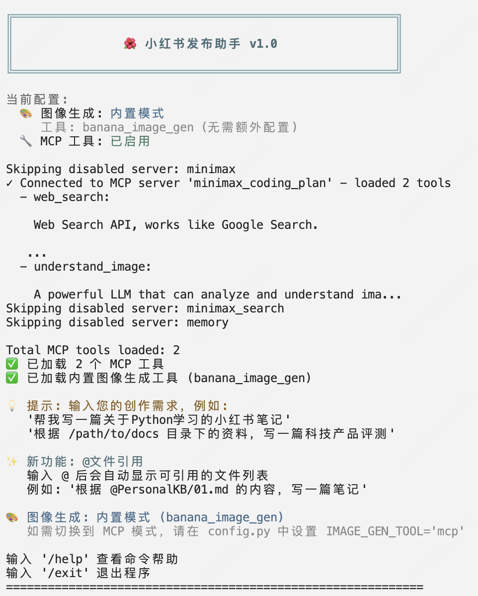

# 小红书发布助手

基于 Mini-Agent 框架的小红书内容自动化创作与发布工具。

## 功能特性

- 根据用户大纲和知识库自动生成小红书风格内容
- 支持 MiniMax-MCP 图片生成工具进行 AI 配图
- 通过 Playwright 自动连接小红书创作平台
- 多轮用户审核与内容修改
- 交互式 CLI 输入（支持光标移动、历史记录、多行编辑）

## 项目结构

```
xhs_publisher/
├── main.py                  # 主程序入口
├── config.py                # 配置管理（路径、参数）
├── prompts.py               # Agent 系统提示词
├── cli_input.py             # CLI 交互式输入组件
├── browser/
│   ├── __init__.py
│   ├── manager.py           # Playwright 浏览器管理
│   └── publisher.py         # 小红书发布逻辑
└── tools/
    ├── __init__.py
    ├── knowledge_tool.py    # 知识库读取工具
    ├── xhs_browser_tool.py  # 浏览器操作工具
    └── user_review_tool.py  # 用户审核工具
```

## 安装

### 1. 安装 Mini-Agent

```bash
cd Mini-Agent
pip install -e .
```

### 2. 安装依赖

```bash
pip install playwright
playwright install chromium
pip install tiktoken
```

#### 安装 MCP 运行环境

MCP 工具需要 `uv` 来运行。如果尚未安装：

```bash
# macOS/Linux
curl -LsSf https://astral.sh/uv/install.sh | sh

# Windows (PowerShell)
irm https://astral.sh/uv/install.ps1 | iex

# 安装完成后，重启终端或运行：
source ~/.bashrc  # 或 ~/.zshrc (macOS/Linux)
```


### 3. 配置环境变量（.env 文件）

为了安全地管理 API Key，建议使用 `.env` 文件存储敏感信息。系统会优先从环境变量读取配置。

复制 `.env.example` 文件，并重命名为 `.env`，然后在 `.env` 文件中填写你的实际值：

```bash
# LLM 配置
MINIMAX_API_KEY=your_minimax_api_key_here
MINIMAX_API_BASE=https://api.minimaxi.com  # 国内用户
# MINIMAX_API_BASE=https://api.minimax.io  # 海外用户
```

> 💡 **提示**: 
> - 系统会优先从环境变量读取配置，这样更安全，避免敏感信息泄露
> - 如果配置了 `.env` 文件，后续在 `config.yaml` 和 `mcp.json` 中可以将 API Key 留空
> - `.env` 文件不会被提交到 Git（已在 `.gitignore` 中忽略）

### 4. 配置 config.yaml 文件

复制配置模板：

```bash
cp mini_agent/config/config-example.yaml mini_agent/config/config.yaml
```

编辑 `config.yaml`，设置：
- `api_key`: 如果已在 `.env` 文件中配置了 `MINIMAX_API_KEY`，此处可以留空或填写空字符串 `""`。系统会优先使用环境变量中的值。
- `api_base`: API 地址（国内用 `https://api.minimaxi.com`，海外用 `https://api.minimax.io`）

**配置示例：**

如果使用 `.env` 文件（推荐）：
```yaml
# api_key 留空，系统会从 .env 文件中的 MINIMAX_API_KEY 读取
api_key: ""
api_base: "https://api.minimaxi.com"  # 国内用户
# api_base: "https://api.minimax.io"   # 海外用户
```

如果不使用 `.env` 文件（不推荐，敏感信息会暴露）：
```yaml
api_key: "your_minimax_api_key_here"
api_base: "https://api.minimaxi.com"
model: "MiniMax-M2.1"
provider: "anthropic"
```

### 5. 配置 MCP 工具

编辑 `mini_agent/config/mcp.json`，配置所有 `"disabled": false` 的 MCP 服务。

> 💡 **提示**: 可以参考 `examples/xhs_publisher/mcp.exmaple.json` 作为配置模板。

#### 5.1 配置 MiniMax Coding Plan MCP

`minimax_coding_plan` 服务提供web_search和understand_image两个工具，无需其他服务商API。需要配置以下环境变量：

```json
{
  "mcpServers": {
    "minimax_coding_plan": {
      "command": "uvx",
      "args": [
        "minimax-coding-plan-mcp",
        "-y"
      ],
      "env": {
        "MINIMAX_API_KEY": "",
        "MINIMAX_API_HOST": "https://api.minimaxi.com"
      },
      "disabled": false
    }
  }
}
```

**配置说明：**
- `MINIMAX_API_KEY`: 你的 MiniMax Coding Plan API Key（必填）， 因为后续websearch时用的minimax_coding_plan工具目前仅支持Coding Plan的API Key，所以建议使用Coding Plan的API Key
- `MINIMAX_API_HOST`: API 地址，国内使用 `https://api.minimaxi.com`，海外使用 `https://api.minimax.io`

**配置方式（二选一）：**

**方式 1：直接在 mcp.json 中配置（不推荐，敏感信息会暴露）**
```json
"env": {
  "MINIMAX_API_KEY": "你的MiniMax Coding Plan API Key",
  "MINIMAX_API_HOST": "https://api.minimaxi.com"
}
```

**方式 2：使用环境变量（推荐，更安全）**

如果已在第 3 步配置了 `.env` 文件，在 `mcp.json` 中保持空字符串，系统会自动从环境变量读取：

保持 `mcp.json` 中的值为空字符串：
```json
"env": {
  "MINIMAX_API_KEY": "",  // 空字符串，会自动从环境变量读取
  "MINIMAX_API_HOST": "https://api.minimaxi.com"
}
```

#### 5.2 其他可选的 MCP 服务

项目还支持以下 MCP 服务，可根据需要启用：

**MiniMax Search MCP（网络搜索）**
- 功能：网络搜索和智能浏览
- 配置：需要 `MINIMAX_API_KEY`，可选 `SERPER_API_KEY` 和 `JINA_API_KEY`
- 启用：将 `"disabled"` 设置为 `false`
- 详细配置说明：
  - `SERPER_API_KEY`: 用于 Google 搜索（可选），访问 [Serper.dev](https://serper.dev) 获取
  - `JINA_API_KEY`: 用于网页内容读取（可选），访问 [Jina AI](https://jina.ai/) 获取

**Memory MCP（知识图谱记忆）**
- 功能：基于图数据库的长期记忆系统
- 配置：无需额外 API Key
- 启用：将 `"disabled"` 设置为 `false`

> 💡 **提示**: 如果不想使用某个 MCP 服务，可以将其 `"disabled"` 设置为 `true`。

#### 5.3 验证 MCP 配置

配置完成后，可以通过运行程序来验证 MCP 工具是否正常加载：

```bash
cd Mini-Agent/examples/xhs_publisher
python main.py
```

如果 MCP 配置正确，程序启动时会显示：
```
✓ Connected to MCP server 'minimax_coding_plan' - loaded X tools
✅ 已加载 X 个 MCP 工具
```

如果遇到连接失败，请检查：
1. API Key 是否正确配置（在 `.env` 文件或 `mcp.json` 中）
2. `uv` 工具是否已安装（运行 `uv --version` 检查）
3. 网络连接是否正常

## 运行

```bash
cd Mini-Agent/examples/xhs_publisher
python main.py
```

## 最终效果展示


## 使用方法

### 基本交互

```
📝 您的问题 › 帮我写一篇关于Python学习的小红书笔记
📝 您的问题 › 根据 /path/to/docs 目录下的资料，写一篇科技产品评测
```

### CLI 命令

| 命令 | 说明 |
|------|------|
| `/help` | 显示帮助信息 |
| `/clear` | 清除屏幕 |
| `/exit` | 退出程序 |

### 快捷键

| 快捷键 | 说明 |
|--------|------|
| `alt+Enter` | 发送输入 |
| `Ctrl+J` | 插入换行（多行输入）|
| `Ctrl+U` | 清除当前行 |
| `Ctrl+L` | 清除屏幕 |
| `↑/↓` | 浏览历史记录 |
| `←/→` | 移动光标 |



## 工作流程

1. **规划阶段** - 分析用户需求，读取知识库，制定内容大纲
2. **内容生成** - 生成小红书风格的标题和正文
3. **图片生成** - 使用 MiniMax MCP 生成 AI 配图
4. **用户审核** - 展示内容，支持多轮修改直到满意
5. **自动发布** - 连接浏览器 → 登录 → 上传内容
6. **完成通知** - 提醒用户在平台确认并发布

## 可用工具

| 工具 | 功能 |
|------|------|
| `read_knowledge` | 读取本地知识库文件 |
| `user_review` | 展示内容并等待用户审核 |
| `xhs_browser` | 浏览器操作 (connect/login/publish/close) |
| `text_to_image` | MiniMax MCP 图片生成 |

## 感谢🙏
- 本项目“小红书发布助手”受到优秀开源项目[xhs_ai_publisher-blue](https://github.com/BetaStreetOmnis/xhs_ai_publisher)的启发，在此表示感谢。
- 感谢 MiniMax 提供强大的 AI 能力和 MCP 工具支持。
- 感谢 Playwright 提供强大的浏览器自动化能力。
- 感谢 Prompt Toolkit 提供强大的命令行交互能力。